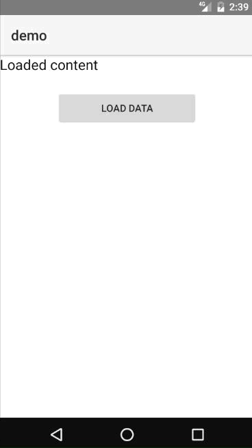
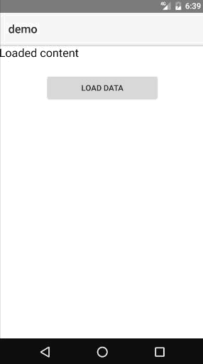
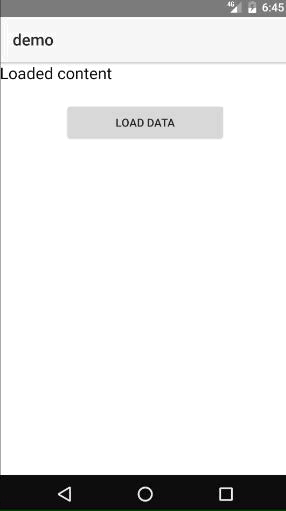
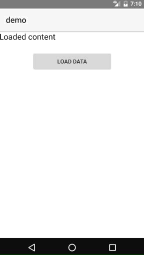

# Nativescript-slideshow-busy-indicator

This plug-in allows you to easily create a busy indicator (loader) like the one illustrated using a set of images that you provide. What it does is cycle through the images with a nice transition.



## Prerequisites

You need a set of images that will be used to be cycled through. The format can be any format that the [NS Image module](https://docs.nativescript.org/cookbook/ui/image) supports. For best looks icon-like images (with transparency like PNGs) do the job. See demo.

## Installation

```
npm install nativescript-slideshow-busy-indicator --save
```

## Usage

You will have to add `xmlns:indicator="nativescript-slideshow-busy-indicator"` namespace to your page tag, and then simply use `<indicator:BusyIndicator/>` in order to add the widget to your page.

The must-set properties are:
images - set this property to an array of strings that represent paths to the images you would like to display, like:
```
public images = ["~/images/01.png", "~/images/02.png", "~/images/03.png", "~/images/04.png"];
```
isBusy - when set to true, the indicator is visible, when false - it is not

Then you can use the indicator like:
```
<indicator:BusyIndicator isBusy="{{ isBusy }}"
 images="{{ images }}"
 indicatorWidth="60" 
 indicatorHeight="60" 
 indicatorBorderRadius="30" 
 indicatorColor="red" />
```

A few examples:

| Output | Code |
| ------ | ------ |
 | <indicator:BusyIndicator isBusy="{{ isBusy }}" <br /> images="{{ images }}" <br /> indicatorWidth="60" <br /> indicatorHeight="60" <br /> indicatorBorderRadius="30" <br /> indicatorColor="red" />| 
 | <indicator:BusyIndicator isBusy="{{ isBusy }}" <br /> images="{{ images }}" <br /> indicatorWidth="90" <br /> indicatorHeight="90" <br /> indicatorBorderRadius="30" <br /> indicatorColor="yellow" <br /> backOpacity="0.4" <br /> backColor="pink" /> | 
 | <indicator:BusyIndicator isBusy="{{ isBusy }}" <br /> images="{{ images }}" <br /> indicatorWidth="120" <br /> indicatorHeight="100" <br /> indicatorBorderRadius="20" <br /> indicatorColor="red" <br /> backOpacity="0.6" <br /> backColor="black" /> | 

## API

| Property | Description |
| ------ | ------ |
| backOpacity| Sets the opacity of the background layer (floating point value from 0 to 1)
| backColor| Sets the color of the background layer (e.g. "red", "#FF0000")
| indicatorOpacity| Sets the opacity of the indicator layer (floating point value from 0 to 1)
| indicatorColor| Sets the color of the indicator layer (e.g. "green", "#00FF00")
| indicatorHeight| Sets the height of the indicator layer in pixels
| indicatorWidth| Sets the width of the indicator layer in pixels
| indicatorBorderRadius| Sets the border radius of the indicator layer (by default is 0, can be set to 0.5 * indicatorHeight if you want to make the indicator circle for example)

## License

Apache License Version 2.0, January 2004
